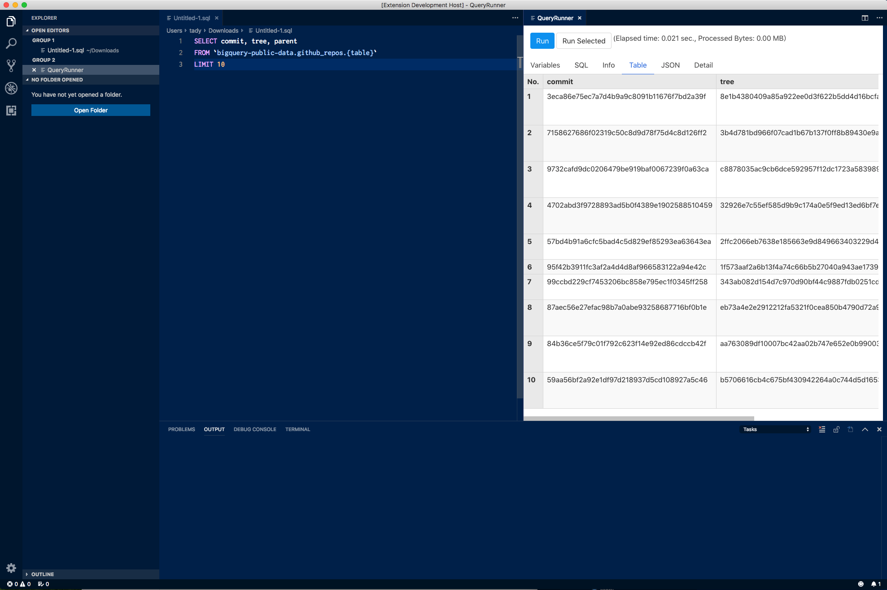

# vscode-query-runner README

A Visual Studio Code ("VS Code") extension that can query Google Cloud Platform's BigQuery analytics database from, and return results to, your editor.

This extension is inspired by [vscode-bigquery](https://github.com/google/vscode-bigquery) a lot. Thank you!

## Features

- Write SQL in editor and directly query BigQuery.
- Replace placeholders in SQL to any value like a template engine.

## Requirements

To query BigQuery dataset, you must have right API previledge of GCP. (e.g. JSON key file)

## Extension Settings

* `queryRunner.projectId`: The project ID from the Google Developer's Console, e.g. 'grape-spaceship-123'. We will also check the environment variable GCLOUD_PROJECT for your project ID. If your app is running in an environment which supports Application Default Credentials, your project ID will be detected automatically.
* `queryRunner.keyFilename`: Full path to the a .json, .pem, or .p12 key downloaded from the Google Developers Console. If you provide a path to a JSON file, the projectId option above is not necessary. NOTE: .pem and .p12 require you to specify the email option as well.
* `queryRunner.location`: The geographic location of all datasets and jobs referenced and created through the client. Default is 'US'.

## Known Issues

When Query result has many rows, table view performance is too terible...

## Release Notes

### 0.0.1

Initial release.

## TODO

- Paging support
- Dry run
- Table view performance
- Shortcut keys
- Query Plan visualization
- OAuth support